# The agent that runs the PR is part of the threat model

## Building a Google ADK repository-review agent that runs untrusted tests and generated patches inside native Cloud Run sandboxes

> **Verified on July 9, 2026**  
> Cloud Run sandboxes are **Public Preview**. Gemini 3.5 Flash is **GA**. The sample pins the latest released Python ADK, `google-adk==2.4.0`.

A coding agent does more than generate a patch. It also runs the repository's tests, build hooks, linters, package scripts, and configuration. That is the dangerous part. Repository-controlled code executes while the agent host may have a service account, metadata access, and network egress.

This article builds one concrete workflow around that risk. A Google ADK agent starts a native Cloud Run sandbox, checks the security boundaries, runs an intentionally failing test suite, writes a repair, reruns the tests, exports a snapshot, and deletes the sandbox. Gemini chooses among narrow, typed tools. Trusted host code fixes the command, paths, mount, timeout, and egress policy before anything runs.

I deployed the workflow on Cloud Run and kept the raw ADK events. The evidence lets us examine three practical questions:

- How should an ADK agent and its tools be structured for a multi-step repository review?
- What does the sandbox isolate, and what remains visible or writable?
- How long does the sandbox lifecycle take, and what does a modest monthly workload cost?

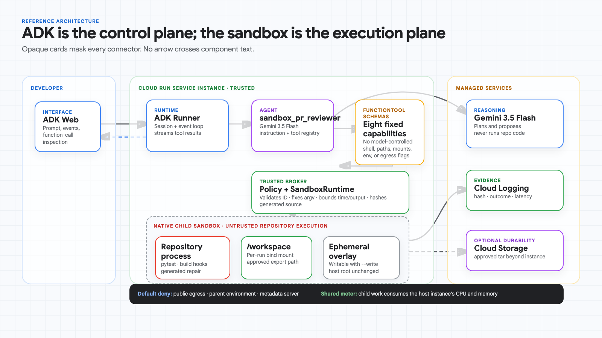

---

## What happened in the measured run

The deployed ADK turn took **19,098.54 ms** from request to final response. It started an egress-denied sandbox, recorded the failing baseline, applied Gemini's 2,309-byte repair, finished with four passing tests, exported the writable overlay, and deleted the sandbox. The figure below shows each stage; the committed JSON contains the complete event payload.

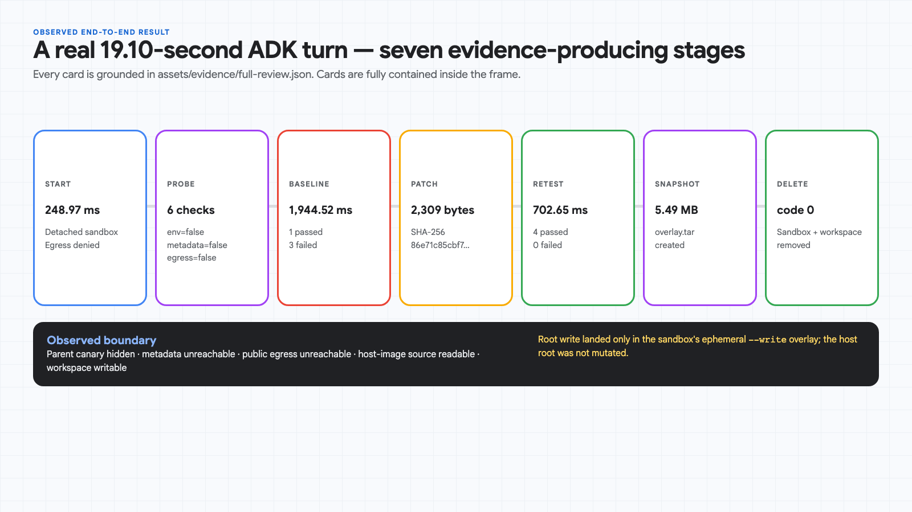

This is not a simulated trace. The complete ADK event payload is committed as [`assets/evidence/full-review.json`](../assets/evidence/full-review.json).

---

## Why this is different from Google's launch example

The Cloud Run announcement deliberately optimizes for first contact: enable `--sandbox-launcher`, run a command, explain the default isolation, and preview the forthcoming ADK executor. That is useful, but it does not answer the application-design questions above.

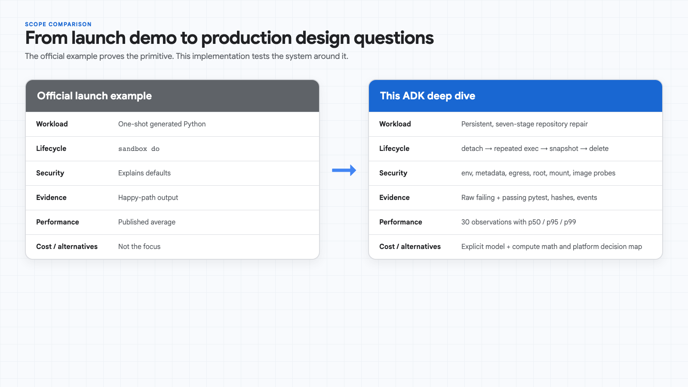

The sample uses the **native** sandbox launcher, not Google's older experimental DIY sandbox service.

---

## Version truth: Gemini 3.5 Flash and released ADK

The deployed agent uses:

```text
MODEL=gemini-3.5-flash
GOOGLE_GENAI_USE_VERTEXAI=TRUE
GOOGLE_CLOUD_LOCATION=global
```

The real event stream reports:

```json
{
  "modelVersion": "gemini-3.5-flash"
}
```

As verified on July 9, 2026, Gemini 3.5 Flash is GA with a 1,048,576-token input window and up to 65,535 output tokens. Global Standard PayGo list pricing is $1.50 per million input tokens and $9.00 per million output/reasoning tokens. Check the current model and pricing pages before reusing those numbers.

There is an important ADK timing detail:

- PyPI's latest release is `google-adk==2.4.0`, released July 7.
- Google's first-party `CloudRunSandboxCodeExecutor` landed on ADK `main` in commit `5b1088acbe…` on July 9.
- Google's launch post says the integration will ship in the next ADK version.

The repository therefore pins released ADK 2.4.0 and implements the lifecycle as typed `FunctionTool`s. It does **not** float on unreleased `main`. When the first-party executor reaches PyPI, migrate behind the same broker contract and rerun every boundary probe.

---

## How the ADK agent is designed

The central application object is a normal ADK `Agent`. This is the actual configuration used by the deployed revision—not pseudocode:

```python
root_agent = Agent(
    name="sandbox_pr_reviewer",
    model=os.getenv("MODEL", "gemini-3.5-flash"),
    description=(
        "Reviews and repairs an untrusted Python repository through a "
        "long-lived, egress-denied Cloud Run sandbox."
    ),
    instruction=INSTRUCTION,
    tools=[
        start_review_workspace,
        inspect_security_boundaries,
        run_test_suite,
        write_candidate_rule_engine,
        snapshot_workspace,
        finish_review_workspace,
        benchmark_sandbox_startup,
        estimate_monthly_cost,
    ],
    code_executor=AuditedCloudRunSandboxCodeExecutor(
        allow_egress=False,
        timeout_seconds=20,
    ),
)
```

Four ADK design choices matter:

1. **The instruction defines the workflow, not the security boundary.** It asks Gemini to establish a baseline, repair from evidence, retest, snapshot, and clean up. Host code still validates every request.
2. **Plain Python functions become typed ADK tools.** ADK derives tool schemas from signatures and docstrings. Gemini can supply `workspace_id` and `source_code`; it cannot supply a shell string, host path, mount target, environment, or egress flag.
3. **The agent has two execution paths.** The fixed `FunctionTool` path implements this repository-review product workflow. The audited `code_executor` remains attached for explicit ADK code-execution events, but the demo intentionally prefers the narrower, easier-to-audit tools.
4. **The ADK Runner owns sessions and events.** Every function call and response becomes an inspectable event. The committed evidence contains 15 returned events; ADK Web renders those same objects.

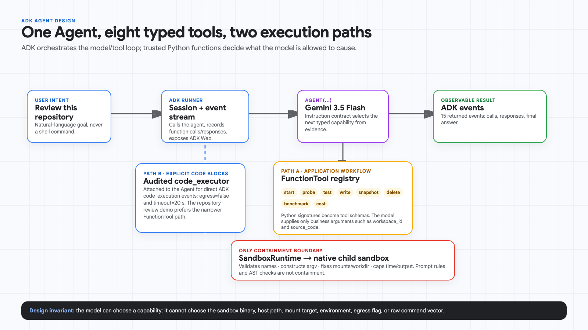

### The tool contract is where the use case becomes testable

For example, the model does not receive a general-purpose `run_shell` capability. It receives a test-specific function:

```python
def run_test_suite(workspace_id: str) -> dict[str, object]:
    _workspace(workspace_id)  # validates the name and instance-local path
    started = time.perf_counter()
    result = RUNTIME.exec(
        workspace_id,
        [
            RUNTIME.python_executable(),
            "-m", "pytest", "-q", "--disable-warnings",
            "/workspace/tests",
        ],
        timeout_seconds=120,
    )
    return {
        "status": "passed" if result.returncode == 0 else "failed",
        "returncode": result.returncode,
        "elapsed_ms": round((time.perf_counter() - started) * 1000, 2),
        "stdout": result.stdout[-8_000:],
        "stderr": result.stderr[-4_000:],
    }
```

The model-proposed repair is also handled as data before it is ever executed:

```python
def write_candidate_rule_engine(
    workspace_id: str,
    source_code: str,
) -> dict[str, object]:
    workspace = _workspace(workspace_id)
    decision = evaluate_python(
        source_code,
        ExecutionPolicy(
            max_code_bytes=24_576,
            blocked_modules=frozenset(),
            blocked_calls=frozenset(),
        ),
    )
    if not decision.allowed:
        return {"status": "rejected", "reason": decision.reason}

    destination = workspace / "rule_engine.py"  # fixed path
    destination.write_text(source_code)
    return {
        "status": "written",
        "sha256": hashlib.sha256(source_code.encode()).hexdigest(),
        "bytes": len(source_code.encode()),
    }
```

The AST/size check is a quality gate. The subsequent import and test still happen only in the native child sandbox.

### Four prompts, four bounded evidence paths

The same agent supports four deliberately different test cases. Each maps to an explicit tool sequence and a success signal that can be checked without trusting the final prose answer.

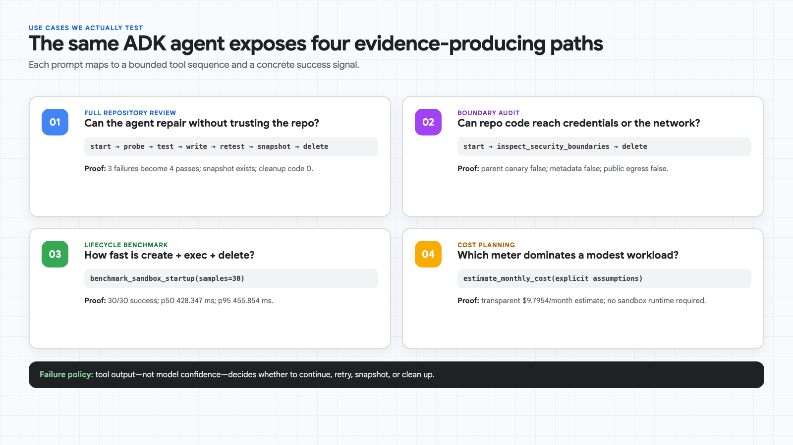

- **Full repository review:** prove failure → repair → passing retest → snapshot → cleanup.
- **Boundary audit:** prove the parent canary, metadata server, and public egress remain unreachable.
- **Lifecycle benchmark:** collect 30 create/exec/delete observations without mixing in Gemini or Cloud Run cold start.
- **Cost planning:** calculate a list-price estimate from explicit inputs without launching a sandbox.

This split matters operationally: `benchmark_sandbox_startup` and `estimate_monthly_cost` are diagnostic tools, not hidden side effects inside the repair path.

---

## The use case: an untrusted repository review

A coding agent usually executes more than the code it generated. It runs repository-controlled machinery:

- `pytest` hooks and `conftest.py`;
- `npm` lifecycle scripts;
- compilers and build-system plugins;
- package installers;
- linters with project configuration;
- generated patches and migration code.

Any of those can read credentials, query the metadata server, open a reverse shell, mutate the agent, poison caches, fork indefinitely, or place hostile content in an exported artifact.

Prompt instructions are not a security boundary. An AST denylist is not a security boundary. The agent host must assume the repository is adversarial before the first test starts.

The demo repository contains an `eval`-based rule engine. Its baseline is intentionally unsafe:

```python
def evaluate_rule(expression: str, record: dict[str, object]) -> bool:
    return bool(eval(expression, {"__builtins__": {}}, record))
```

Removing `__builtins__` does not make general Python evaluation safe. The test suite requires a constrained AST evaluator instead.

---

## Trust boundaries

The application has three distinct decision planes:

1. **Gemini 3.5 Flash proposes.** It chooses which typed capability to call and can propose replacement source.
2. **The trusted ADK host authorizes.** It validates workspace IDs, fixes mount paths, denies egress, caps source size, parses Python, bounds output, and sets wall-time limits.
3. **The Cloud Run sandbox contains.** It isolates process state, parent environment, metadata credentials, and network access.

The model never controls raw values for:

```text
--allow-egress
--env
--mount
--rootfs
--workdir
sandbox names
host paths
```

The broker constructs an argument vector; it never interpolates model text into a shell command.

### Read-only does not mean confidential

The probe observed:

```json
{
  "host_application_source_visible": true,
  "metadata_server": {"reachable": false, "error_type": "URLError"},
  "parent_canary_visible": false,
  "public_egress": {"reachable": false, "error_type": "URLError"},
  "root_filesystem": {"writable": true},
  "workspace_mount": {"writable": true}
}
```

Two results need careful interpretation:

- **Host source was readable.** Files baked into the service image are visible to the child sandbox. Never bake secrets or tenant data into the image.
- **The root write succeeded because the sandbox was started with `--write`.** The write landed in the sandbox's ephemeral overlay. It did not mutate the underlying host root filesystem. The dedicated `/workspace` bind mount was intentionally writable and visible to trusted host code.

The distinction matters more than a simplistic “root is read-only” claim.

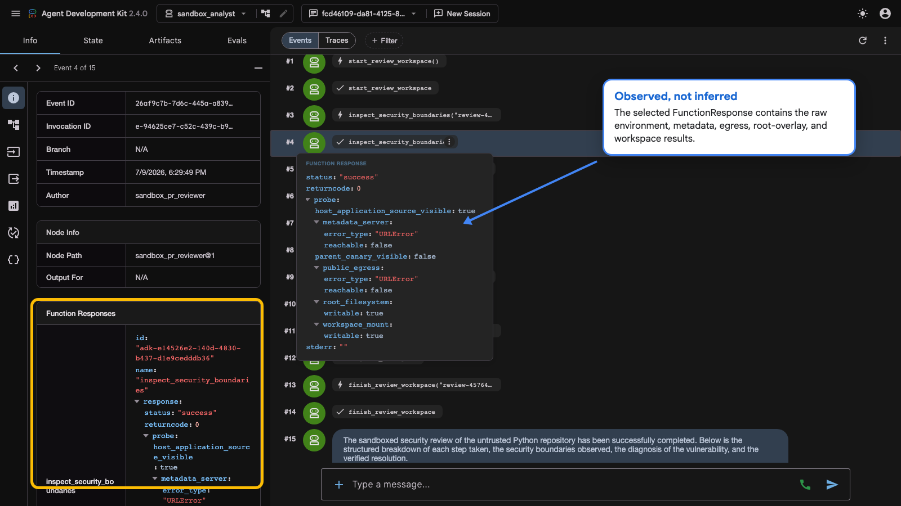

---

## Implement the long-running lifecycle

The lifecycle wrapper accepts validated IDs only:

```python
_SANDBOX_ID = re.compile(r"^[a-z][a-z0-9-]{2,62}$")


def start(self, sandbox_id: str, workspace: Path) -> SandboxResult:
    self._check_id(sandbox_id)
    workspace = workspace.resolve(strict=True)
    mount = f"type=bind,source={workspace},destination=/workspace"
    return self._run([
        self.sandbox_bin,
        "run",
        "--write",
        "--mount", mount,
        "--workdir", "/workspace",
        sandbox_id,
        "--",
        "/bin/sh", "-c",
        "trap 'exit 0' TERM INT; while :; do sleep 3600; done",
    ])
```

Subsequent operations target that named sandbox:

```python
runtime.execute(workspace_id, [sys.executable, "-m", "pytest", "-q", "/workspace/tests"])
runtime.snapshot(workspace_id, session_dir / "overlay.tar")
runtime.delete(workspace_id)
```

The ADK agent exposes a fixed capability set:

```python
tools=[
    start_review_workspace,
    inspect_security_boundaries,
    run_test_suite,
    write_candidate_rule_engine,
    snapshot_workspace,
    finish_review_workspace,
    benchmark_sandbox_startup,
    estimate_monthly_cost,
]
```

A `finally` block is not available to an LLM. The system instruction therefore requires cleanup, while the host still treats orphan cleanup as an operational responsibility. Cloud Run instance termination eventually removes instance-local sandboxes, but production services should also run a TTL janitor.

---

## Inspect the real ADK Web flow

ADK Web is a development interface, not a production UI. The Cloud Run service stays private and is reached through an authenticated proxy:

```bash
gcloud run services proxy sandbox-analyst-adk \
  --project "$PROJECT_ID" \
  --region us-central1 \
  --port 8080
```

The deployed container permits only the two local development origins used by the proxy:

```text
http://localhost:8080
http://127.0.0.1:8080
```

The evidence artifact contains 15 returned events: six lifecycle function calls, six function responses, a second test call/response, and the final answer. The submitted user prompt is stored separately by the API client.

For reproducible documentation, the capture script imports that committed event array into ADK Web instead of spending model quota on a second run. The event sequence remains inspectable as native ADK UI objects:

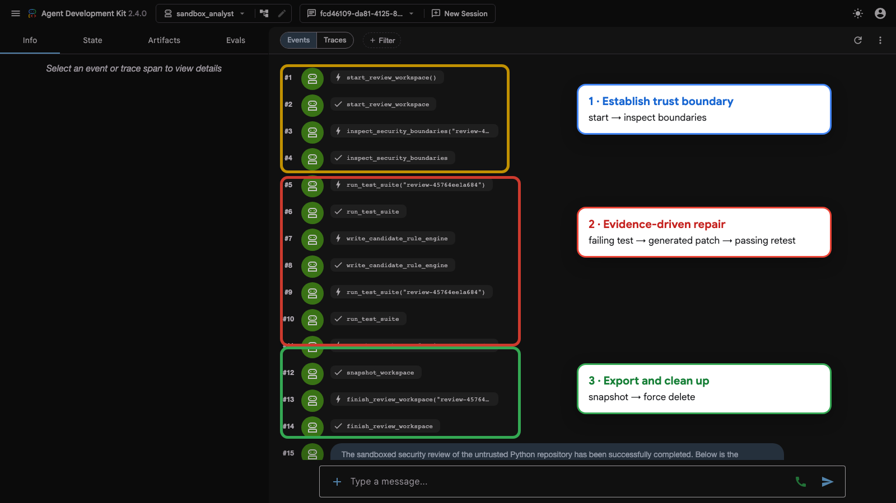

The final response links the repair, passing tests, snapshot, and teardown:

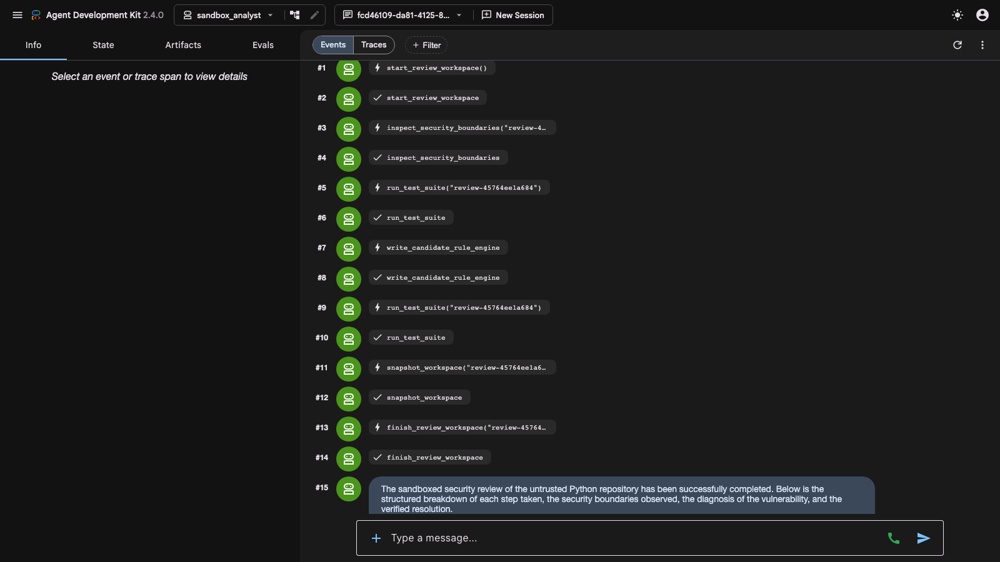

Selecting the first `run_test_suite` response exposes the raw failing baseline instead of a prose summary:

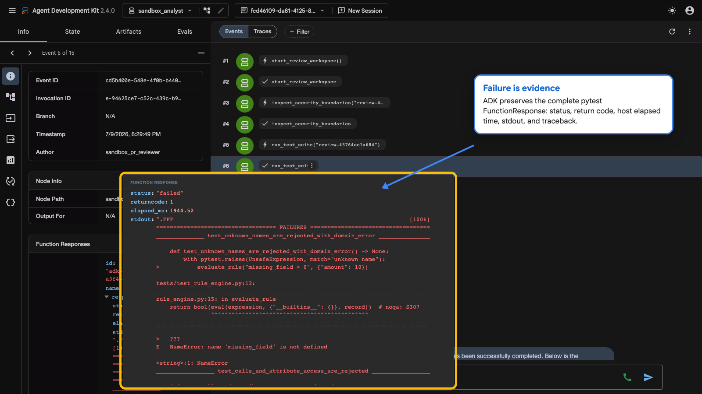

An imported event session does not recreate the backend trace-span store. The screenshots therefore show event evidence only; they do not pretend that a replayed session contains live timing spans. Capture the **Traces** tab during the original run if span-level timing is required.

---

## Raw test evidence

### Local, cloud-free quality gates

The local suite never executes model-generated code on the workstation. It mocks process creation and verifies command construction, egress defaults, policy short-circuiting, ID validation, workspace mounting, model configuration, and cost math.

```console
$ uv run pytest
..............                                                           [100%]
14 passed, 4 warnings in 0.86s

$ uv run ruff check .
All checks passed!
```

The four warnings are ADK deprecation warnings for `BaseAgentConfig`; they do not indicate failing tests.

### Raw failing baseline inside the native sandbox

```text
.FFF                                                                     [100%]

FAILED tests/test_rule_engine.py::test_unknown_names_are_rejected_with_domain_error
FAILED tests/test_rule_engine.py::test_calls_and_attribute_access_are_rejected
FAILED tests/test_rule_engine.py::test_only_scalar_record_values_are_accepted

3 failed, 1 passed in 0.06s
```

The host measured **1,944.52 ms**, including the `sandbox exec` boundary and process overhead—not just pytest's internal 60 ms.

### Raw passing result after the generated repair

```text
....                                                                     [100%]
4 passed in 0.01s
```

The host measured **702.65 ms**. The generated source was **2,309 bytes**, recorded by full SHA-256 without logging the code itself.

### Raw event artifacts

The repository preserves the actual responses:

- [`full-review.json`](../assets/evidence/full-review.json): complete 15-event returned repair sequence;
- [`latency.json`](../assets/evidence/latency.json): all 30 lifecycle observations;
- generated graphs retain links to those source files.

Treat raw model/tool output as potentially sensitive in a real system. This demo repository is synthetic and contains no credentials or customer data.

---

## Measured sandbox lifecycle distribution

The benchmark runs:

```text
inside one warm Cloud Run service instance:
  sandbox do -- /bin/true
  = create + execute + delete
```

All 30 samples succeeded. The chart carries the summary statistics and every individual observation, so Medium readers do not need an unsupported table.

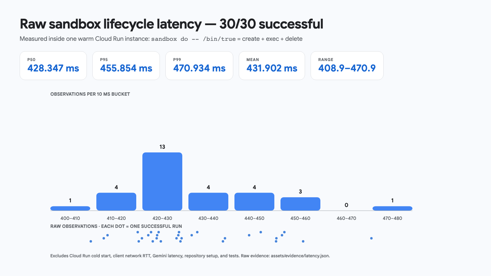

Raw observations, in milliseconds:

```text
408.941, 411.805, 412.636, 419.308, 419.535, 420.234,
421.636, 422.254, 422.630, 423.492, 423.597, 423.925,
424.414, 427.881, 428.270, 428.424, 428.751, 429.003,
431.236, 432.464, 438.133, 438.582, 443.916, 446.491,
449.871, 449.949, 451.179, 451.711, 455.854, 470.934
```

Google's launch post reports a 500 ms average across 1,000 start/execute/stop requests. Our mean is 431.902 ms, but this is **not** a league table: image, region, service size, measurement path, and sample count differ.

### What this benchmark does not measure

It excludes:

- Cloud Run service cold start;
- client-to-service network RTT;
- Gemini inference and reasoning;
- repository checkout and dependency installation;
- actual test duration.

Do not collapse all of those stages into “sandbox startup.” Optimize the stage that is actually slow.

---

## Cost optimization: tokens dominate this example

Cloud Run sandboxes have no separate premium; child work consumes the parent instance's allocated CPU and memory. That does not mean execution is free.

For a modest, easier-to-reason-about scenario:

```text
1,000 repository reviews/month
30 active sandbox seconds/review
2 vCPU + 2 GiB
observed effective concurrency = 2
3,000 Gemini input tokens + 500 output tokens/review
```

The reproducible list-price model returns **$9.7954/month before free tier**:

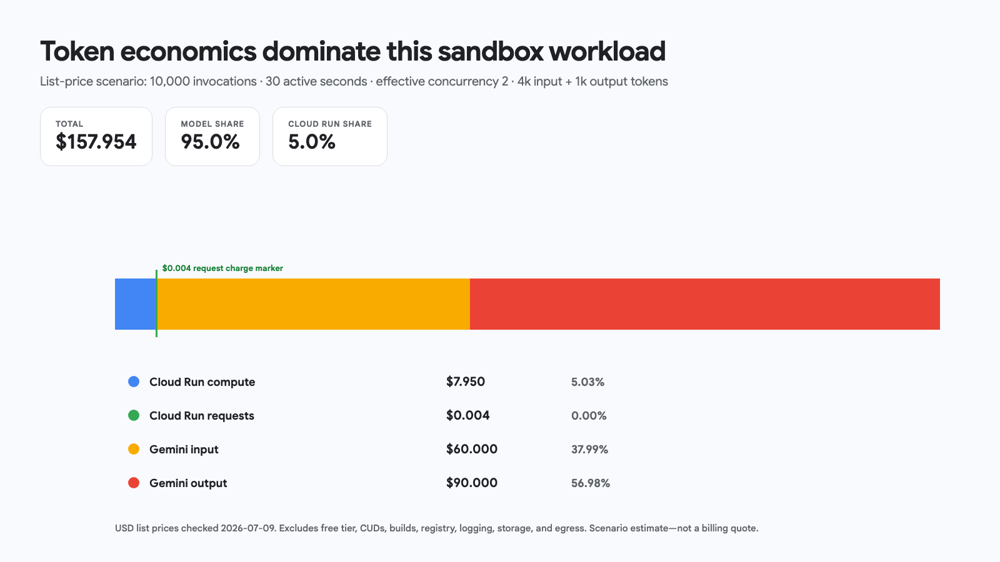

In this scenario, model tokens are **91.88%** of estimated cost: $4.50 input plus $4.50 output. Cloud Run compute contributes $0.795, and requests contribute $0.0004. The optimization order should usually be:

1. eliminate unnecessary model turns and repeated repository context;
2. cap output and reasoning budgets;
3. cache reusable analysis where policy allows;
4. reuse one detached sandbox within a single repair turn;
5. then tune concurrency and instance resources from measured CPU/memory contention.

The estimate excludes free tiers, committed-use discounts, builds, registry storage, logs, durable artifacts, and egress. It is a workload model, not a billing quote.

### Concurrency is not free parallelism

The child sandboxes share the containing Cloud Run instance's 2 vCPU and 2 GiB. Four CPU-heavy test suites on one instance do not receive four independent 2-vCPU allocations. This repository deploys with `--concurrency 1` for reproducible evidence. Raise concurrency only after load-testing the worst permitted repository.

---

## Cloud Run versus GKE and hosted sandbox services

“EDB” is assumed to mean **E2B**; confirm that before publishing a named competitive claim.

These products expose different isolation units and billing meters. Published latency claims are not directly comparable.

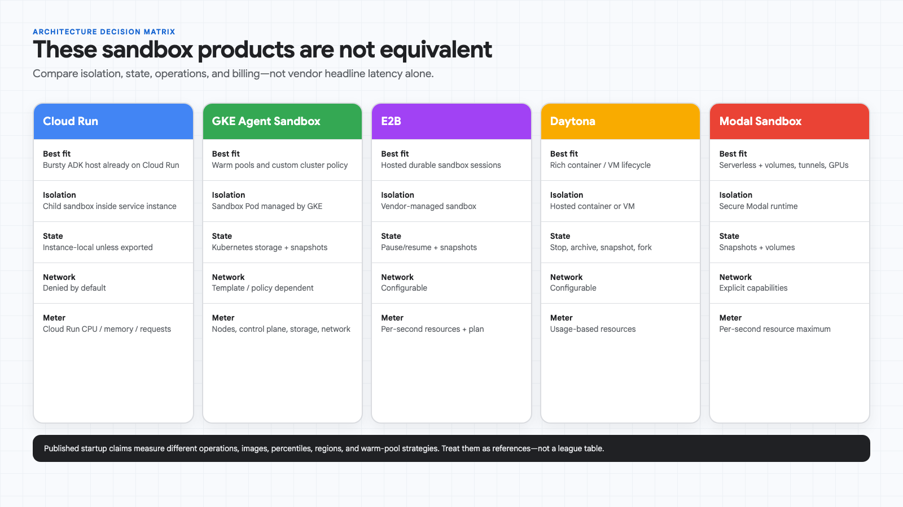

Choose Cloud Run when:

- the ADK host is already a Cloud Run service;
- workloads are bursty and request-bound;
- deny-by-default egress is desirable;
- scale-to-zero and a minimal control plane matter;
- exporting state between instances is acceptable.

Choose GKE Agent Sandbox when:

- you need large warm pools, custom network policy, custom scheduling, or cluster-local dependencies;
- sandbox state must participate in Kubernetes storage and orchestration;
- operating cluster capacity is an acceptable trade-off.

Choose a hosted sandbox platform when durable session APIs, cross-cloud placement, snapshots, tunnels, GPU options, or vendor-managed developer ergonomics matter more than staying inside the Cloud Run resource model.

The full sourced matrix is in [`docs/decision-matrix.md`](decision-matrix.md).

---

## Deployment settings that produced the evidence

The successful revision used:

```text
Cloud Run revision: sandbox-analyst-adk-00003-2jt
execution environment: gen2
sandbox launcher: enabled
CPU: 2
memory: 2 GiB
concurrency: 1
minimum instances: 0
maximum instances: 3
request timeout: 3600 seconds
session affinity: enabled
service authentication: required
model: gemini-3.5-flash
```

Deploy:

```bash
export PROJECT_ID="your-project-id"
export REGION="us-central1"
./scripts/deploy.sh
```

The runtime service account receives `roles/aiplatform.user`. The deployment script retries the first IAM binding because a newly created service account can take several seconds to propagate.

---

## Production limitations the demo intentionally exposes

### Named sandboxes are instance-local

A detached sandbox ID is meaningful only inside the Cloud Run instance that created it. Keep a multi-step lifecycle inside one request. For cross-request work, export approved state to durable storage and design for resumption on another instance.

### Session affinity is not durability

ADK Web in this repository uses an in-memory session service. Cloud Run session affinity improves local development behavior but is best-effort; it does not turn process memory into a database. Production ADK deployments need a durable session service.

### The request is the lifecycle envelope

The service timeout is 3,600 seconds. A long review must checkpoint before that envelope closes. Cloud Run can also terminate an instance; do not promise an immortal development VM.

### Egress is coarse

The documented sandbox interface provides deny-by-default plus `--allow-egress`. It is not a per-domain policy engine. Package installation and browser-agent workloads need a controlled fetch broker or proxy if unrestricted egress is unacceptable.

### Output and artifacts are hostile

Stdout, JUnit XML, tar contents, HTML reports, and symlinks come from untrusted code. Bound bytes, reject traversal, inspect archive members, escape rendered text, and persist only approved artifacts.

### Shared-resource denial of service remains

Isolation reduces compromise risk; it does not manufacture CPU or memory. Bound process time, output, file size, child count, service concurrency, and maximum instances.

---

## Repository map

```text
sandbox_analyst/
├── agent.py          Gemini 3.5 Flash agent and orchestration contract
├── lifecycle.py      argv-safe named-sandbox lifecycle wrapper
├── tools.py          typed ADK capabilities and per-request workspaces
├── executor.py       audited one-shot ADK code-executor adapter
├── policy.py         application policy; explicitly not containment
└── costs.py          transparent workload cost model
samples/unsafe_rule_engine/
├── rule_engine.py
├── security_probe.py
└── tests/
assets/
├── evidence/         raw ADK JSON events
├── screenshots/      real ADK Web captures
└── *.png             Google Sans diagrams and measured graphs
docs/
├── tutorial.md
├── threat-model.md
├── benchmark-methodology.md
└── decision-matrix.md
scripts/
├── deploy.sh
├── run_evidence.py
├── capture_adk_web.py
├── cost_model.py
└── smoke_test.py
```

---

## Reproduce the evidence

Local checks:

```bash
uv sync --extra dev
uv run pytest
uv run ruff check .
```

Deploy, then save authenticated raw events:

```bash
uv run python scripts/run_evidence.py \
  --service-url "$(gcloud run services describe sandbox-analyst-adk \
    --region "$REGION" --format='value(status.url)')" \
  --scenario full-review

uv run python scripts/run_evidence.py \
  --service-url "$SERVICE_URL" \
  --scenario latency
```

Capture the UI through a running authenticated proxy:

```bash
python scripts/capture_adk_web.py
```

Delete the Cloud Run service when finished. Also remove the Artifact Registry repository and service account if they are dedicated to the demo; scale-to-zero does not eliminate registry storage charges.

---

## Sources

- Google Cloud Blog: [Cloud Run sandboxes are in public preview](https://cloud.google.com/blog/topics/developers-practitioners/google-cloud-run-sandboxes-are-in-public-preview/)
- Google Cloud: [Code execution in Cloud Run](https://docs.cloud.google.com/run/docs/code-execution)
- Google Cloud: [Sandbox CLI reference](https://docs.cloud.google.com/run/docs/reference/sandbox-cli)
- Google Cloud: [Cloud Run pricing](https://cloud.google.com/run/pricing)
- Google Cloud: [Cloud Run container runtime contract](https://docs.cloud.google.com/run/docs/container-contract)
- Vertex AI: [Gemini 3.5 Flash model](https://cloud.google.com/vertex-ai/generative-ai/docs/models/gemini/3-5-flash)
- Vertex AI: [Generative AI pricing](https://cloud.google.com/vertex-ai/generative-ai/pricing)
- Google ADK: [Python 2.4.0 release](https://github.com/google/adk-python/releases/tag/v2.4.0)
- Google ADK: [`CloudRunSandboxCodeExecutor` commit](https://github.com/google/adk-python/commit/5b1088acbefb7eb55488ed9ebf90683f24bfe54a)
- Google ADK: [Web interface](https://google.github.io/adk-docs/runtime/web-interface/)
- Google Cloud: [GKE Agent Sandbox](https://docs.cloud.google.com/kubernetes-engine/docs/how-to/agent-sandbox)
- E2B: [Billing](https://e2b.dev/docs/billing) and [persistence](https://e2b.dev/docs/sandbox/persistence)
- Daytona: [Sandbox documentation](https://www.daytona.io/docs/en/sandboxes/)
- Modal: [Sandboxes](https://modal.com/docs/guide/sandboxes) and [pricing](https://modal.com/pricing)

---

## Conclusion

The strongest reason to use Cloud Run sandboxes is not that Gemini can execute Python. It is that an agent can run **repository-controlled, multi-step work** without giving that work the agent host's environment, metadata credentials, network, or durable filesystem.

The measured trade-off is concrete:

- about **428 ms p50** for create/exec/delete inside a warm service instance;
- **19.10 seconds** for a complete six-tool repair turn;
- no separate sandbox premium, but shared CPU/memory and instance-local state;
- token cost dominates the example workload more than sandbox compute.

That makes Cloud Run a strong default for bursty Google Cloud-native agents—provided the application treats sandbox lifecycle, state export, artifact validation, and cost telemetry as first-class product code rather than launch-demo details.
